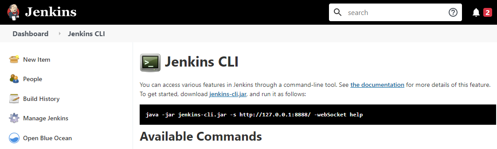

----
# Jenkins Labs - Run Jenkins CLI

[](https://console.cloud.google.com/cloudshell/editor?cloudshell_git_repo=https://github.com/nirgeier/JenkinsLabs)

### **<kbd>CTRL</kbd> + click to open in new window**   

---

### 02. Download the Jenkins CLI
- Navigate to `<jenkins_server_url>/cli` and copy the wget command to download the Jenkins_cli tool.

```sh
# Download the Jenkins cli tool
wget http://<jenkins_server_url>/jnlpJars/jenkins-cli.jar
```



---
:arrow_backward: [01-Run-Jenkins](../01-Run-Jenkins)  
:arrow_forward:  [03-Adding-Users](../03-Adding-Users)