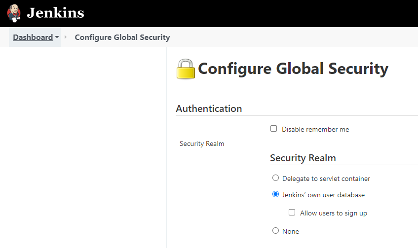

----
# Adding Users

- 01. [Adding user within the GUI](#01-adding-user-within-the-gui)
- 02. [Adding user using jenkins-cli]

---

### 01. Adding user within the GUI
- Navigate to `Manage Jenkins > Configure Global Security` or to: `<jenkins_server_url>/configureSecurity/`
- Under `Authentication > Security Realm` you will find 3 options:
    - Delegate to servlet container
    - **Jenkins’ own user database**
    - None
- Here, we are creating user under `Jenkins’ own user database`. 
    
- Click `Save`
- Fill in the user details and `Create ...`

---

### 02. Adding user using jenkins-cli
- Assuming you already have the `jenkins-cli`, if not get it [here](../02-Download-Jenkins-CLI)
- We will use the API to create new user
```sh
# Define the desired user and password
# Execute the API command for creating the user
echo 'jenkins.model.Jenkins.instance.securityRealm.createAccount("<username>", "<password>")' \
| java -jar jenkins-cli.jar -s <jenkins_server_url> groovy =
```