----
# Jenkins Labs - Building Jobs Pipeline
---

- In this lab we will build a pipeline of multiple jobs

---
### Creating Job #1
- `Dashboard > New item`
    - Enter an item name (Job1)
    - Choose free style project
    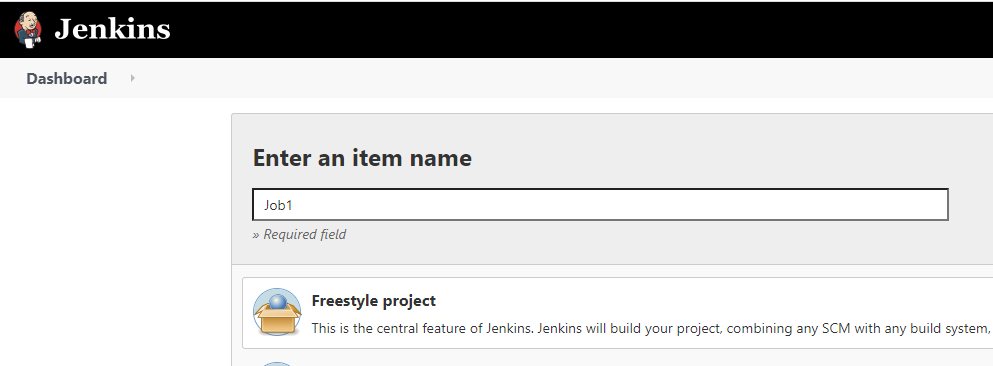
    - Click `Ok`
    - Add build phase (Execute shell) and set some command
    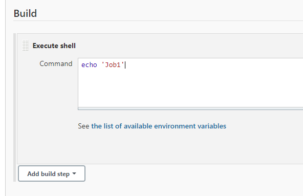
    - Click 'Save'

### Creating Job #2
- `Dashboard > New item`
  - Enter an item name (Job2)
  - This time we will use an existing job as our base job. Choose the last option `Copy From` and in the text field use Job1 from prevoius step
  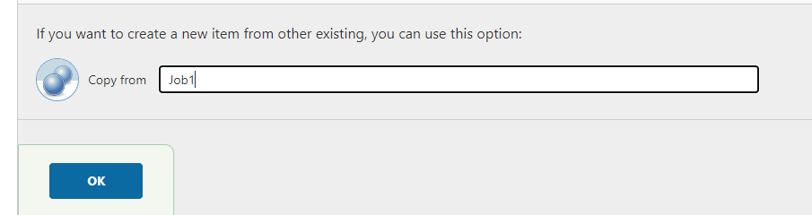
  - Click `Ok`
  - Once the `Configuration` screen is displayed, set the desired command for this job
  - Click `Apply`

### Creating Job #3
- Repeate the same as when you created Job#2

---

### Building the pieline
- Our pipeline will be `Job1 > Job2 > Job3`.
- Each job shoulr run only if the prevoius one succeed.

### Set the relationship
#### **Job1 -> Job2**
- Open `Job1` configurations and under the `Post Build Actions` select `Build Other Projects` and select `Job2`.
 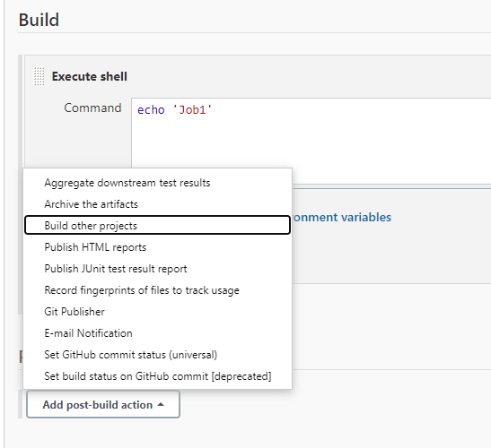
  
 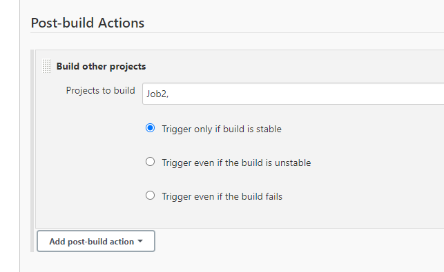
- Click `Apply` 
 
 #### **Job2 -> Job3**
 - Open `Job3` configurations and under the `Build Triggers` select `Build after other projects are built` and set it to Job2.

 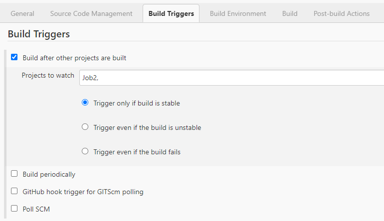

 ---
### Upstreams and Downstreams
- Jenkins calls these connections `Upstreams` and `Downstreams`. 
- In the context of `Job1`, `Job2` defined as `Downstream`.
- In the context of `Job2`, `Job1` is `Upstream` and so on

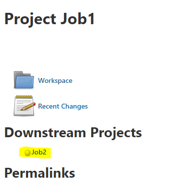

---

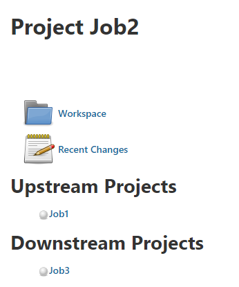

---

### Install Pipeline Plugin
- To get a better view of the complete pipeline and the workflow, install the `Build Pipeline` plugin which allows creation of a special view for connected jobs.

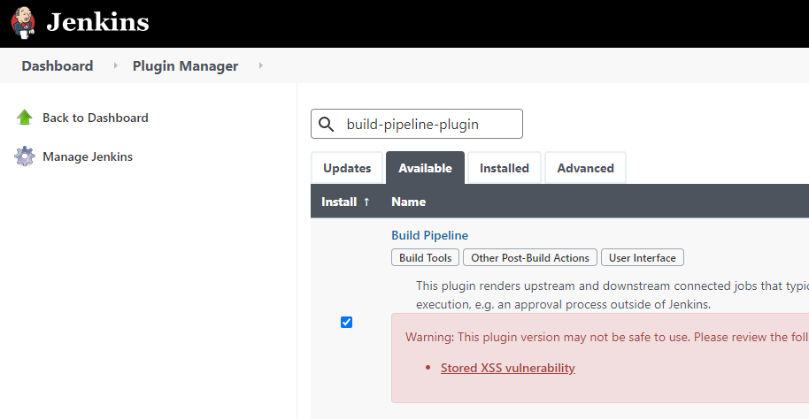

### Create Pipeline View
- From Jenkins dashboard click on the `+` in the main view panel.
- Provide a name to the view 
- Check `Build Pipeline View`. 
- Click `OK`

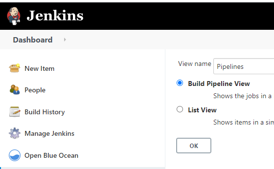

- Verify that the configuration is the following:
    - Here you can set the number of build to display as well

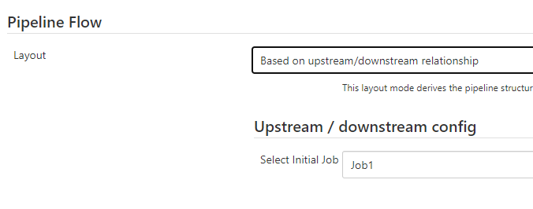

- Click `Ok`
- Naviagte to the and you should see the pipelines

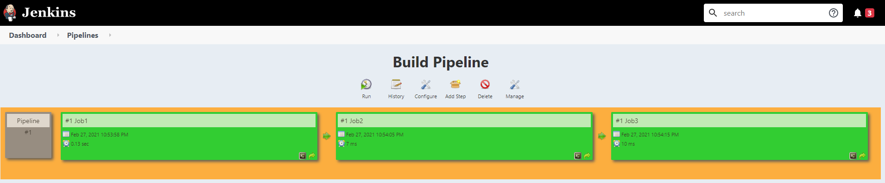

- Pipeline view also shows the history of job runs up to the number of instances you selected earlier in the configuration.